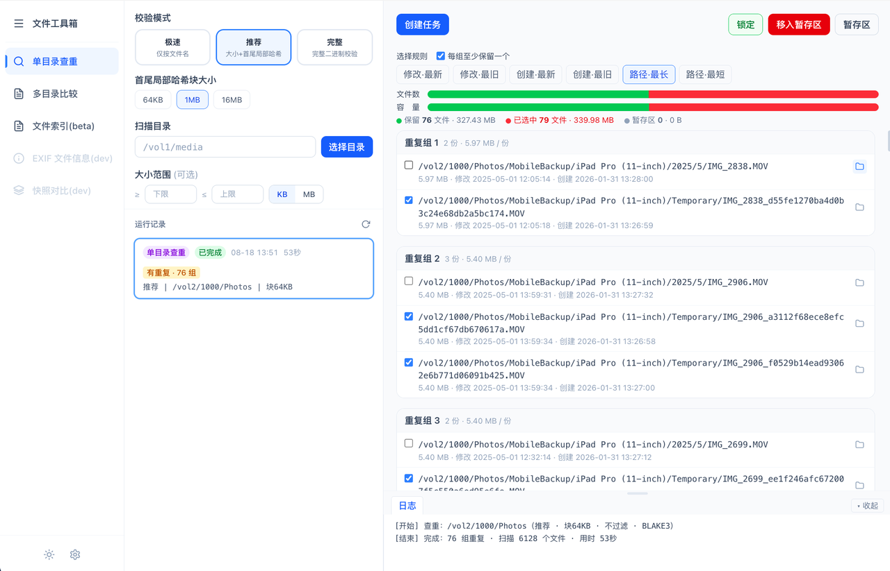
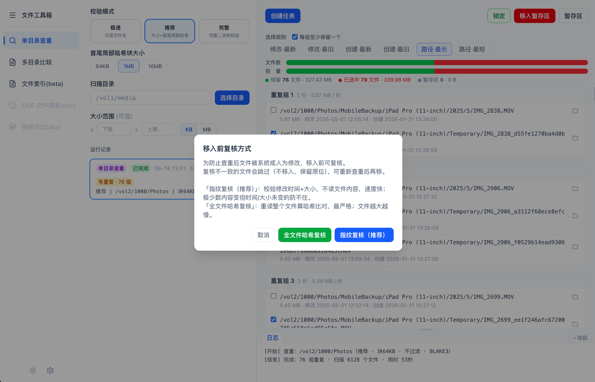
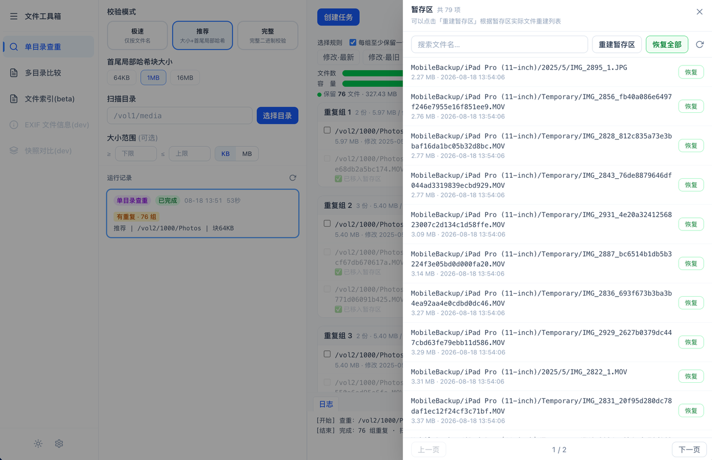
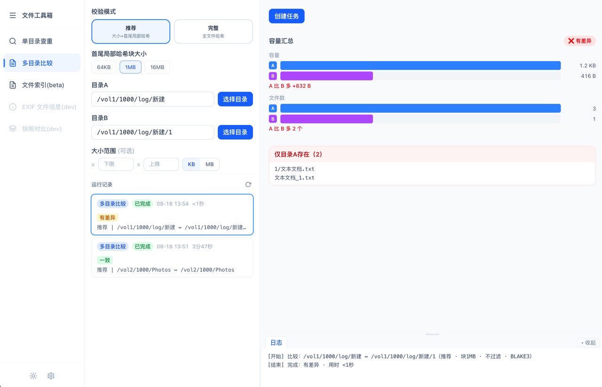
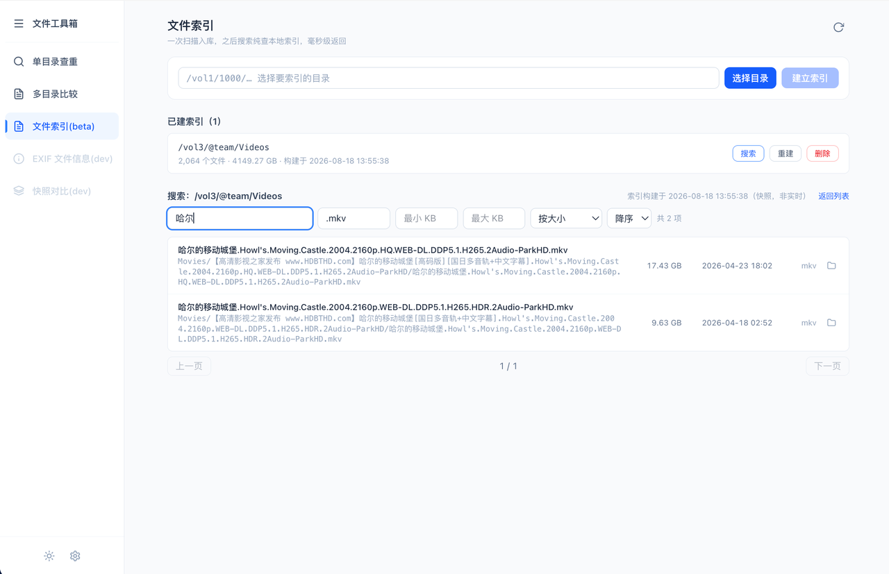

# 文件工具箱（file-tools）

  

  <b>飞牛（fnOS）第三方应用</b> · 文件校验、查重、信息查看等常用操作，按需选用、互不干扰

  
  
  
  

> 接入 fnOS 开放 API 能力底座：应用内原生目录选择器选目录并授权、任务目录语义路径展示、主题跟随系统、任务运行中离开提示、结果文件在文件管理器中打开。仅管理员可用。

---

## 工具集

### 单目录查重

扫描单个目录，按内容哈希找出重复文件，统计冗余占用，可勾选重复文件移入暂存区释放存储空间。

> 查重结果：重复组与冗余占用统计

- **三种校验模式**：极速 / 推荐 / 完整，兼顾速度与准确率

  | 模式 | 说明 |
  |------|------|
  | 极速 | 仅按文件名分组（不读内容），秒级完成 |
  | 推荐 | 大小 + 首尾局部哈希，兼顾速度与准确率 |
  | 完整 | 全文件哈希校验，绝对可靠 |

- **暂存区**：勾选重复文件移入暂存区（可恢复），支持整组移入、按规则批量勾选、锁定保留项。系统不替你直接删文件——重复文件先移入暂存区缓冲，确认无用后再彻底删除，避免误删不可逆
- **移入前复核**：移入暂存区前复核文件未被改动——「指纹复核」校验修改时间 + 大小（快）、「全文件哈希复核」重读整个文件（最严格），复核不一致的跳过、保留原位
- **任务模型**：一个目录同时只有一个任务，运行中不可删除；删除任务须先处理暂存区（恢复全部 / 永久删除 / 取消）

> 移入前复核：指纹复核（mtime + 大小）或全文件哈希复核

> 暂存区：重复文件先移入缓冲，确认无用后再彻底删除

### 多目录比较

比对两个目录的文件清单差异与内容一致性，验证备份 / 同步完整性，输出差异报告与容量汇总。校验模式同单目录查重。

> 比较结果：文件清单差异与内容一致性

### 文件索引

选一个目录建立持久化索引（只读扫描，记录文件名 / 大小 / 修改时间），之后搜索**纯查本地索引库、毫秒级返回**——适合「目录文件多、想快速按名找文件」的冷查找场景。

> 文件索引：按文件名 / 扩展名 / 大小过滤搜索

- **搜索能力**：文件名子串（大小写不敏感、支持中文）、扩展名 / 大小范围过滤、按名称 / 大小 / 修改时间排序、分页
- **一目录一索引**：可重建（原子替换）/ 删除（含取消进行中构建）；构建显示进度、可取消，关应用窗后台续跑、重开可重连进度
- **隔离旁路**：索引构建只读扫描、只写应用自有数据目录（不写被扫目录）；查重 / 比较照旧实时遍历文件系统、**永不读索引**——不影响现有工具的数据新鲜度

### EXIF 文件信息 `开发中`

查看照片 / 视频的元信息（拍摄时间、相机、光圈、快门、ISO、焦距等），支持多文件对比。

### 快照对比 `开发中`

对比目录在不同时间点的快照，追踪文件的新增、删除、变更，掌握目录的演进变化。

---

## 使用场景

- 影视资源备份校验
- 数据迁移完整性验证
- 磁盘空间清理（重复文件）
- 同步工具结果验证（rsync、Syncthing 等）
- 目录内快速按文件名检索（文件索引）

---

## 安装

1. 在 [Releases](https://github.com/Haorran/file-tools/releases) 下载最新 `.fpk` 安装包
2. 打开 fnOS 桌面 → **应用中心 → 手动安装**，选择下载的 `.fpk` 文件上传
3. 授权目录：新系统（≥ 1.2.0401）创建任务时点「选择目录」走原生目录选择器选目录即自动授权；旧系统自动降级为系统设置手动授权

**环境要求：**

| 项 | 要求 |
|---|---|
| fnOS 系统版本 | ≥ 1.1.3100（统一网关最低要求）；开放 API 能力需 ≥ 1.2.0401，旧系统自动降级为手动授权 |
| 宿主 App 版本 | ≥ 1.34.0 |
| 使用权限 | **仅管理员**（桌面仅管理员可见图标） |

**开放 API 能力（0.1.29+ 接入）：**

- **应用内选目录授权**：创建任务时点「选择目录」弹出 fnOS 原生目录选择器，选目录同时完成授权，无需到系统设置手动勾授权目录
- **授权范围校验**：只能扫描已授权目录及其子目录，未授权路径被拒绝（安全边界清晰）
- **授权目录管理**：设置页查看 / 移除已授权目录
- **语义路径展示**：任务卡片目录摘要显示 fnOS 语义路径（如「存储空间1/admin 的文件/...」）而非裸 `/vol1/...`
- **主题跟随系统**：自动跟随 fnOS 系统明暗主题，实时切换
- **任务运行中离开提示**：有任务运行时关闭页面弹出确认提示
- **在文件管理器中打开**：查重结果文件项可一键打开文件管理器定位到所在目录
- **窗口标题动态更新**：随当前功能页更新宿主窗口标题
- **旧系统降级（0.1.52+）**：无开放 API 的旧系统自动降级——应用内选目录改为系统设置手动授权、路径显示原始路径，同一安装包通吃

---

## 注意事项

> **执行「永久删除」与「清空暂存区」为物理删除，不经过系统回收站，删除前请再三确认。**

- **先小范围验证**：首次使用建议先对一个小目录扫描，熟悉流程后再处理重要数据
- **不要扫描系统 / 应用目录**：如 `/`、`@app`、系统盘等，应用没有也不需要这些权限
- **授权目录即权限边界**：只能扫描已授权目录及其子目录，未授权路径被拒绝是安全设计，不是故障
- **单任务模型**：一个目录（或目录对）同一时刻只有一个任务，运行中不可删除；删除任务须先处理该目录暂存区（恢复全部 / 永久删除 / 取消）
- **历史结果在应用私有目录**：保存在 `@appdata/results`，用户文件管理器不可见，需要时经应用内「导出 / 下载」取出

---

## FAQ

**创建任务提示目录未授权？**
创建任务时点「选择目录」走 fnOS 原生目录选择器选目录即自动授权；或到设置页查看 / 添加授权目录。旧系统（< 1.2.0401）需在系统设置手动授权。

**「检查更新」显示「暂无更新信息」？**
开发期正常现象，不是故障。应用通过 GitHub Releases 查询新版本，未发布 Release 时即显示该提示。

**关掉应用窗口，任务会停吗？**
不会。任务在后台线程运行，关窗口不杀进程、不停任务；重新打开应用会自动恢复显示运行中 / 已完成的任务。

**查重 / 比较很慢？**
「极速」模式只按文件名分组，秒级完成；「推荐 / 完整」模式需要读取文件内容，机械盘或大目录较慢属正常。可先用「推荐」模式扫一个小目录验证流程。

**删掉的任务还能恢复吗？**
移入暂存区的文件可恢复（逐项或整组）；执行「永久删除」后不可恢复。

**历史结果在哪里？**
保存在应用私有数据目录 `@appdata/results`，用户文件管理器不可见；需要时经应用内「导出 / 下载」取出。

---

## 更新日志

见 [CHANGELOG.md](./CHANGELOG.md)。

---

## 作者

灏然 · [GitHub](https://github.com/Haorran/file-tools) · [飞牛主页](https://club.fnnas.com/home.php?mod=space&uid=64436)
